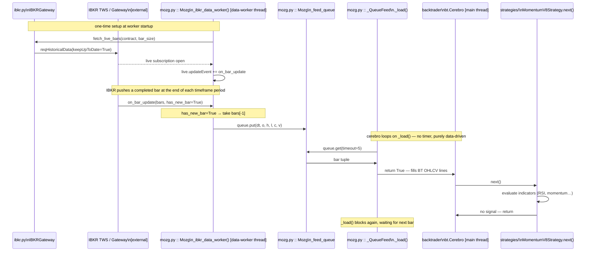
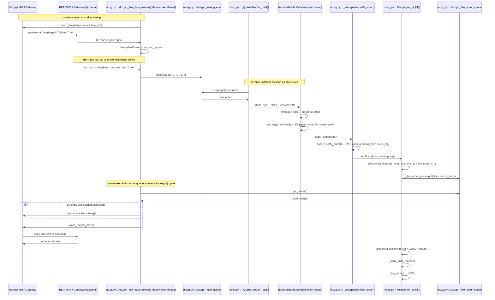

# r7trader — Strategy Execution Flow

## Architecture Overview

Two threads run concurrently inside `Mozg.run()`:

| Thread | Role |
|---|---|
| **Main thread** | Runs `cerebro.run()` — consumes bars, executes strategy logic |
| **data-worker thread** | Fetches OHLCV bars from the exchange, pushes them onto `_feed_queue` |

`_QueueFeed` is the bridge between them. `_on_bt_fill` is the bridge between Backtrader's paper broker and the real exchange.

### How the timeframe drives strategy.next()

Cerebro has no internal timer. It calls `_QueueFeed._load()` in a loop and blocks until a bar appears on `_feed_queue`. `strategy.next()` fires exactly once per bar. The bar frequency equals the configured `timeframe`.

**IBKR** — event-driven: `reqHistoricalData(keepUpToDate=True)` opens a subscription. IBKR pushes a completed bar automatically at the end of each timeframe period. `on_bar_update(bars, has_new_bar)` fires only when `has_new_bar=True`.

**ccxt** — poll-driven: worker polls the exchange every `poll_interval_s` seconds (default 5s). A new bar is delivered only when the returned candle timestamp (`bar[0]`) is greater than the last seen timestamp, i.e. a new candle has closed.

---

## Case 1 — Bar arrives, no trade signal

---

## Case 2 — Bar arrives, order signal generated and routed to IBKR

---

## Key Components

| Component | Class | File | Role |
|---|---|---|---|
| `Mozg` | `Mozg` | `mozg.py` | Top-level engine — wires everything together |
| `_QueueFeed` | `_QueueFeed` | `mozg.py` | BT data feed backed by a thread-safe queue |
| `_make_live_strategy` | `_Wrapped` (generated) | `mozg.py` | Wraps strategy to intercept BT fills |
| `_on_bt_fill` | `Mozg` | `mozg.py` | Classifies signal, routes real order, logs trade |
| `_ibkr_data_worker` | `Mozg` | `mozg.py` | Subscribes to IBKR live bars + drains IBKR order queue |
| `_ccxt_data_worker` | `Mozg` | `mozg.py` | Polls ccxt for new closed candles |
| `fetch_live_bars` | `IBKRGateway` | `ibkr.py` | Opens `reqHistoricalData(keepUpToDate=True)` subscription |
| `place_market_order` | `IBKRGateway` | `ibkr.py` | Sends a market order to IBKR |
| `place_bracket_trailing` | `IBKRGateway` | `ibkr.py` | Sends a bracket order with trailing stop to IBKR |
| Strategy `next()` | e.g. `MomentumV8Strategy` | `strategies/` | Evaluates indicators, calls `self.buy()` / `self.sell()` |
| `notify_order` | e.g. `MomentumV8Strategy` | `strategies/` | Updates per-trade state (entry price, trailing stop, trade log) |
